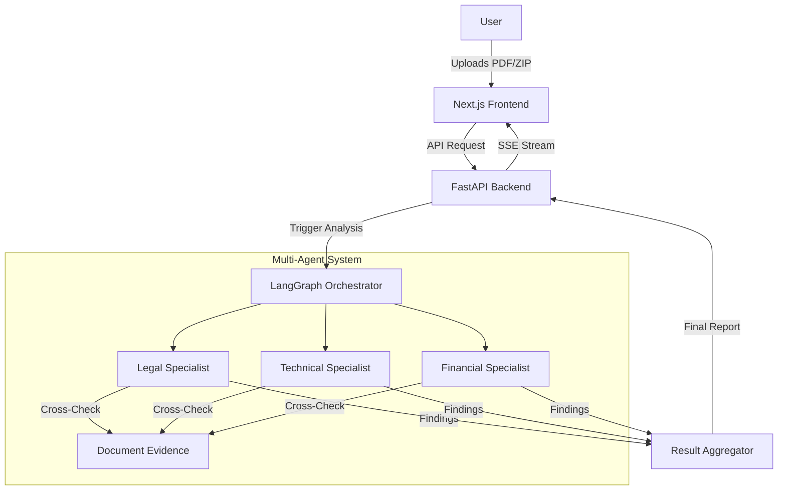

# AI-Powered Tender Analyst


An autonomous, multi-agent system designed to audit public tender proposals by cross-referencing claims with documentary evidence.

## The Operational Challenge

Manual evaluation of tender proposals represents a critical bottleneck for any organization. The primary risk lies not in declared information, but in the technical discrepancies often found between main forms and hundreds of pages of supporting annexes. This process, traditionally slow and prone to human error, often leads to unfair disqualifications or the awarding of contracts to entities that do not truly meet the requirements.

## The Solution

**AI-Powered Tender Analyst** is an autonomous system based on graph architecture that automates deep verification of proposals. Unlike conventional text analysis methods, this system employs a specialized workflow coordinating three parallel audit fronts: **Legal**, **Technical**, and **Financial**.

Each agent operates under a cross-validation logic: it doesn't just read what the bidder claims to fulfill, but actively searches, extracts, and analyzes specific evidence within attached documents to confirm the veracity of the declaration.

### Impact on Decision Making

The system transforms unstructured documentation into an Objective Viability Score. Upon completion, the user obtains:

*   **Omission Detection**: Instant identification of requirements lacking documentary support.
*   **Inconsistency Analysis**: Detailed reporting of discrepancies between declared values and found evidence.
*   **Risk Mitigation**: Classification of findings by severity levels to prioritize human review on critical points.

By reducing days of manual review to seconds of structured processing, **AI-Powered Tender Analyst** ensures that supplier selection is based on verifiable data, removing subjectivity and strengthening the rigor of the contracting process.

## Key Features

- **Multi-Agent Orchestration**: Powered by LangGraph to coordinate specialized agents (Legal, Technical, Financial).
- **Real-time RUC Validation**: Direct integration with SRI (Ecuador) to validate taxpayer status and economic activity.
- **Deep Document Analysis**: Extracts and analyzes text from PDFs and massive ZIP archives.
- **Live Progress Streaming**: Server-Sent Events (SSE) provide real-time feedback on the analysis pipeline.
- **Objective Scoring**: Generates a quantified compliance score based on evidence, not just claims.

## Architecture



## Quick Start

### Prerequisites

- **Python 3.9+**
- **Node.js 18+**
- **uv** (Modern Python package manager)
- **OpenAI API Key**

### 1. Backend Setup

```bash
# Clone the repository
git clone https://github.com/johncortes117/ai-tender-analyst.git
cd ai-tender-analyst

# Install dependencies using uv
uv sync

# Configure Environment
cp .env.example .env
# Edit .env and add your OPENAI_API_KEY

# Run the API
uv run uvicorn app.api.main:app --reload
```

### 2. Frontend Setup

```bash
cd frontend

# Install dependencies
npm install

# Run the development server
npm run dev
```

Visit `http://localhost:3000` to start analyzing tenders.

## Project Structure

```
ai-tender-analyst/
├── app/
│   ├── agents/          # LangGraph agents and tools
│   ├── api/             # FastAPI endpoints and routers
│   ├── core/            # Configuration and constants
│   └── utils/           # Helper functions
├── data/                # Storage for tenders and proposals
├── frontend/            # Next.js application
├── tests/               # Pytest suite
└── pyproject.toml       # Python dependencies (managed by uv)
```

## Contributing

We welcome contributions! Please see [CONTRIBUTING.md](CONTRIBUTING.md) for details on how to get started, run tests, and submit PRs.

## License

This project is licensed under the MIT License - see the [LICENSE](LICENSE) file for details.